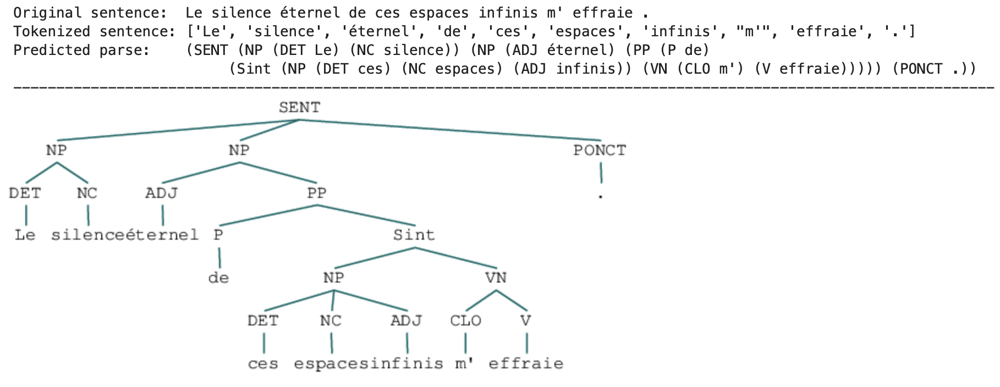
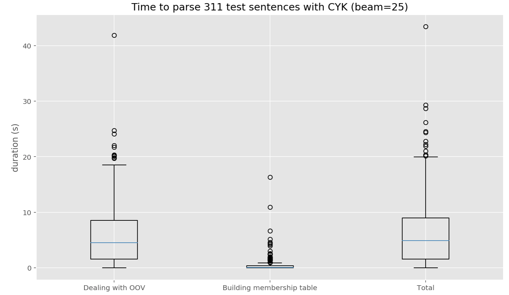

# French grammatical parser

#### Course project ([MVA Course "Algorithms for speech and language processing", 2020, Dupoux, Zeghidour & Sagot](https://github.com/edupoux/MVA_2020_SL)) 

The goal of this project was to develop a basic probabilistic parser for French, based on the CYK algorithm and the PCFG model and that is robust to unknown words.

Parser can be trained on annotated dataset [sequoia corpus](https://github.com/edupoux/MVA_2020_SL/blob/master/TD_%232/sequoia-corpus%2Bfct.mrg_strict).

 The proposed OOV module uses French word embeddings, which can be given by [the Polyglot embedding lexicon for French](https://sites.google.com/site/rmyeid/projects/polyglot).

## Run the parser (file: ```run.sh```):

In a nutshell, arguments allows to:

- Build grammar from file (path ```--train_path```): ex: sequoia-corpus+fct.mrg_strict
- Use only a fraction of training file going from (```--train_strat``` x nb_sentences) to  (```--train_end``` x nb_sentences): ex: ```-train_start=0```, ```-train_end```=0.8
- Build oov module from embeddings stored in file given by file path ```--embedding_path```: ex: polyglot-fr.pkl
- Apply  cyk with chosen ```-beam``` search to make predictions: ex: ```--beam```=25
- Make predictions from sentences in file (path ) ```--test_path```): ex:   ```--test_path```=sequoia-corpus+fct.mrg_strict
- Use only a fraction of test file going from (```--test_strat``` x nb_sentences) to  (```--test_end``` x nb_sentences): ex: ```--test_start```=0.9, ```--test_end```=1.
- Chose to only make predictions (in case you only have raw data) or evaluate the algorithm (in that case, input file must contain parsed data): ```--mode``` = 'prediction' or 'evaluation'
- Store predictions in file (path ```outputted_path```): ex: ```--output_path```=evaluation_data.parser_output

###  Details

```bash
optional arguments:

  -h, --help            show this help message and exit
  
  --train_path TRAIN_PATH, -t TRAIN_PATH
                        set path where to find training data
                        
  --train_start TRAIN_START
                        start data fraction for train data (default 0)
                        
  --train_end TRAIN_END
                        end data fraction for train data (default 1)
                        
  --test_path TEST_PATH, -T TEST_PATH
                        set path where to find test data
                        
  --test_start TEST_START
                        start data fraction for test data (default 0)
                        
  --test_end TEST_END   end data fraction for test data (default 1)
  
  --embedding_path EMBEDDING_PATH, -e EMBEDDING_PATH
                        set path where to find french word embeddings
                        
  --mode MODE, -m MODE  set mode: - 'prediction' / 'e': predict only -
                        'evaluation' / 'e': predict and evaluate predictions
                        
  --output_path OUTPUT_PATH, -o OUTPUT_PATH
                        set path where to write predictions (if None nothing
                        will be written)
                        
  --beam BEAM, -b BEAM  set beam search size for cyk algorithm (default 10)
```

## Examples

##### Example of configurations

```bash
chmod +x run.sh

# make predictions and parsing evaluations from parsed sentences in the last 10% of 'sequoia-corpus+fct.mrg_strict'
./run.sh  --train_path='sequoia-corpus+fct.mrg_strict' --test_path='sequoia-corpus+fct.mrg_strict' --mode='evaluation' --train_end=0.8 --test_start=0.9 --test_end=1 --beam=10 -e='polyglot-fr.pkl' --output_path='evaluation_data.parser_output'

# make predictions from raw sentences in 'test_file.txt'
./run.sh -t='sequoia-corpus+fct.mrg_strict' -T='test_file.txt' -m='prediction' --train_end=0.8 --test_start=0 -b=100 -e='polyglot-fr.pkl' -o='test_file_output.txt'
```


##### Example of prediction:




##### Indication on execution time for test sentences taken from the [sequoia corpus](https://github.com/edupoux/MVA_2020_SL/blob/master/TD_%232/sequoia-corpus%2Bfct.mrg_strict):


